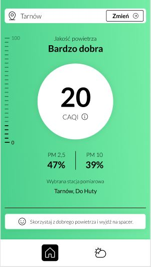
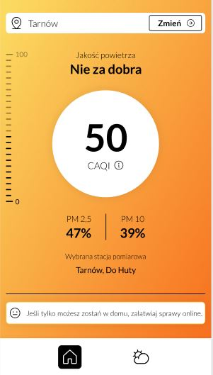
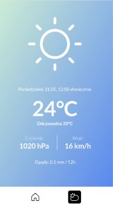
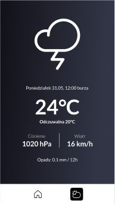

# Clean Air
> Aplikacja mobilna pozwalająca na sprawdzenie stanu pogody oraz jakości powietrza.

## Spis treści
* [Ogólne informacje](#Ogólne-informacje)
* [Zrzuty widoków z aplikacji](#Zrzuty-widoków-z-aplikacji)
* [Technologie](#Technologie)

## Ogólne informacje
Głównym celem aplikacji jest udostępnienie możliwości sprawdzenia pogody i stanu powietrza. Aplikacja prosi o zezwolenie na korzystanie z GPS urządzenia, na którego podstawie sprawdza najbliżej zlokalizowane radary pogody oraz powietrza. 

## Zrzuty widoków z aplikacji

## Technologie
* Android Studio
* Dart
* Flutter
